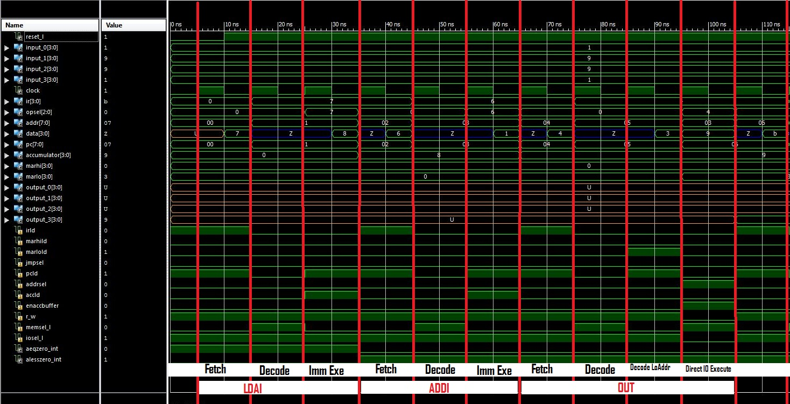
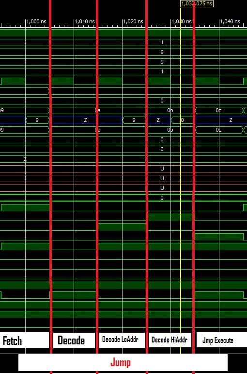

ECE281_Lab5
===========

PRISM

##Discussion of 1st Program Operation

Big picture, the first program loads 8 into the accumulator. It then adds 1 and displays the value held in the 
accumulator on port 3. It continues to loop until the accumulator no longer holds a negative value, i.e. the MSB has
a change from 1 to 0. After, it passes the JN instruction it enters the "end" loop and carries out an infinite loop
that doesn't do anything. 

Why someone would need this functionality I don't know. 

##Discussion of 1st Program Instruction Cycles

### LDAI ADDI and OUT Instructions

### JN Instruction

### JMP Instruction

##Answers to PRISM Questions

1.	When the controller’s current state is “FETCH,” what is the status of the following control lines:
  1. PCLd = 1
  2. IRLd = 1
  3. ACCLd = 0

2.  The current state is Decode LoAddr and the IR contains “OUT.”  What are the control signals 
are asserted, and what will the next state be?
  * MarloLd, PCLd, R_W, Memsel_L are all asserted. The next state will be Decode HiAddr

3.  What are the three status signals sent from the PRISM datapath to the PRISM controller?
  * IR, A=0, A<0

4.  Why is it important that ACCLd signal be active during the execute state for the ADDI instruction?
  *If ACCLd is not active during the execute state, the operand would fail to load into the accumulator
  and would produce an erroneous result. 
  
5.  What changes are necessary to the PRISM datapath to add another instruction (SUBI, which would 
subtract an immediate value from the accumulator) to the instruction set?
  * We would have to add another bit to the OpSel bus to enable us to choose between 9 instructions 
  instead of 8. This would mean we would also have to add one bit to IR, the Data Bus. We would also
  have to implement a multiplexer for 9 options. 
  
##Use of Git
I didn't make many commits in this lab because I would extensively test my ROM's in the simulator before
implementing the programs on the FPGA. This meant I wouldn't have to troubleshoot when it came time to 
implement and I achieved expected results on all three implemenations. 

##Required Functionality

### 1st Program Demo on FPGA
Demonstrated to Dr. Neeble in class.

### 2nd Program Functionality
Demonstrated to Capt. Silva in class on FPGA.

## A/B Functionality
You have recieved a deeply encrypted message from a covert operative engaged in clandestine operations in 
Russia. The operative has provided you with a PRISM ROM and the cipher text:
`1111 1100 1111 BREAK 1011 1100 1110 1010` which you cleverly deduce is binary representing the hex characters:
FCF BCEA. Upon programing your standard issue FPGA and a little experimentation you discover the following outputs
when you manipulate the switches.

### Input 1010

### Input 1011

### Input 1100

### Input 1101

### Input 1110

### Input 1111

### Input OTHERS
no change... 

### Your task
Can you determine who and where the Russians will strike next given the clues above? Your country is counting on
you. 

### Answer (Spoilers ahead!)
...........................................

..........................................

.........................................

........................................

.......................................

......................................

.....................................

....................................

...................................

..................................

.................................

................................

...............................

..............................

.............................

............................

...........................

..........................

.........................

........................

.......................

......................

.....................

....................

...................

..................

.................

................

...............

..............

.............

............

...........

..........

.........

........

.......

......

.....

....

...

..

.

DAD FACE? Oh my God, it's worse than we thought... They're going to get your Dad in the face. We'll get him into
protective custody. Good work Airman!

░░░░░░░░░░░░░░░░░░░░░░░░░░░░░
░░░░░░░░░░░░░▄▄▄▄▄▄▄░░░░░░░░░
░░░░░░░░░▄▀▀▀░░░░░░░▀▄░░░░░░░
░░░░░░░▄▀░░░░░░░░░░░░▀▄░░░░░░
░░░░░░▄▀░░░░░░░░░░▄▀▀▄▀▄░░░░░
░░░░▄▀░░░░░░░░░░▄▀░░██▄▀▄░░░░
░░░▄▀░░▄▀▀▀▄░░░░█░░░▀▀░█▀▄░░░
░░░█░░█▄▄░░░█░░░▀▄░░░░░▐░█░░░
░░▐▌░░█▀▀░░▄▀░░░░░▀▄▄▄▄▀░░█░░
░░▐▌░░█░░░▄▀░░░░░░░░░░░░░░█░░
░░▐▌░░░▀▀▀░░░░░░░░░░░░░░░░▐▌░
░░▐▌░░░░░░░░░░░░░░░▄░░░░░░▐▌░
░░▐▌░░░░░░░░░▄░░░░░█░░░░░░▐▌░
░░░█░░░░░░░░░▀█▄░░▄█░░░░░░▐▌░
░░░▐▌░░░░░░░░░░▀▀▀▀░░░░░░░▐▌░
░░░░█░░░░░░░░░░░░░░░░░░░░░█░░
░░░░▐▌▀▄░░░░░░░░░░░░░░░░░▐▌░░
░░░░░█░░▀░░░░░░░░░░░░░░░░▀░░░
░░░░░░░░░░░░░░░░░░░░░░░░░░░░░
